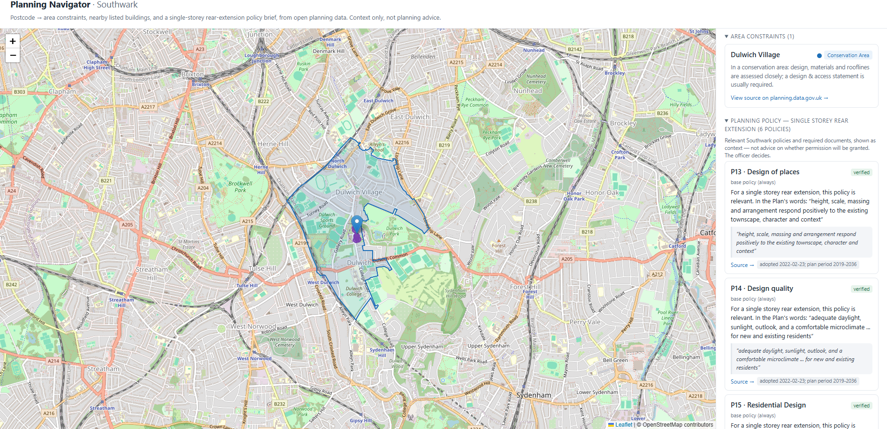
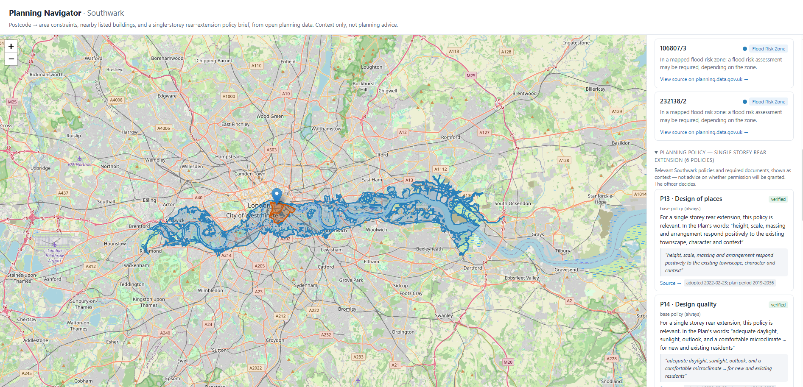
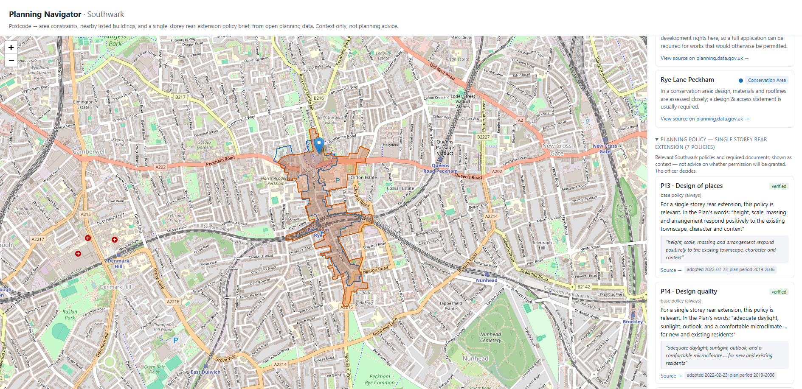

# Planning Navigator — Southwark

**postcode → area constraints + nearby listed buildings + a cite-or-abstain policy brief
(single-storey rear extension), from open planning data.**
Surfaced as context, not planning advice — the decision sits with Southwark's planning officers.

- `postcodes.io` geocodes the postcode.
- `planning.data.gov.uk` is queried twice: (A) a lat/long point-in-polygon query for **area
  constraints** (conservation areas, Article 4, TPO zones, flood-risk zones, scheduled monuments)
  plus **listed-building outlines**; (B) a bbox `intersects` query for **nearby listed-building
  points** (≈100 m, distance + bearing + grade).
- A **policy brief** for a single-storey rear extension is built from the site's constraints:
  - a hand-curated gold-label map (`single_storey_rear_extension.yaml`) decides
    **which** Southwark Plan 2022 policies apply — the LLM never decides relevance;
  - the LLM only (a) explains each policy grounded in its verbatim excerpt and (b) grounding-
    verifies that explanation with a three-way verdict: **SUPPORTED / INSUFFICIENT / CONTRADICTED**;
  - anything not SUPPORTED is suppressed and becomes an abstention — the verbatim cited excerpt
    (with source link + version) is always shown either way.
- The browser shows a Leaflet map (site pin, constraint polygons, listed-building points, radius
  circle) and a side panel: constraints → listed buildings → policy brief → required documents →
  abstentions → disclaimer + OGL attribution.

The policy-map format is scheme-generic; v1 ships one scheme — single-storey rear extension —
end-to-end. Deliberately out of scope for v1: other scheme types (loft/dormer queued), dimension /
threshold checking, PD-vs-application or consent verdicts (surfaced as abstentions), vector RAG.

## Screenshots

Worked examples (deterministic mode — with the live LLM the italicised excerpt restatements become
plain-English paraphrases, each still shown beside its verbatim source and passed through the
grounding check before display):

**SE21 7BG — Dulwich Village conservation area** (6 policies engaged):



**SE1 9TG — flood-risk zone by the Thames** (6 policies engaged):



**SE15 5JR — Rye Lane Peckham conservation area, with an Article 4 direction** that can remove
permitted-development rights (7 policies engaged):



## Status

**v1.0 — a portfolio repository, run locally. No hosted demo, by design.** Putting the live LLM
behind a public URL would expose an API key to unbounded cost and rate-limit abuse, which belongs in
a separate, protected deployment phase (a deterministic-only public demo first; a guarded live-LLM
mode with usage caps later) rather than in v1. Reviewers can read the code, this README, and the
live eval results below; technical readers can clone and run it in about a minute. The app runs
key-free in its deterministic mode out of the box.

## Run it

```bash
cd planning-navigator
python -m venv .venv && source .venv/bin/activate   # optional
pip install -r requirements.txt
uvicorn app:app --reload
```
Open **http://localhost:8000**, type a postcode (or hit a preset), "Check site".

## LLM modes

**Deterministic fallback (default — no key, no cost).** Explanations restate the policy excerpt
verbatim ("In the Plan's words: …"), which is honest but not paraphrased. Nothing calls the API.

**Live model (opt-in).** Both flags must be set, otherwise the fallback runs:

```bash
# bash
export PLANNING_USE_ANTHROPIC=1
export ANTHROPIC_API_KEY=...        # keep out of shell history / screenshots
```
```powershell
# PowerShell
$env:PLANNING_USE_ANTHROPIC = "1"
$env:ANTHROPIC_API_KEY = ...        # see eval section for a screenshot-safe way to set this
```
Model defaults to Haiku; override with `ANTHROPIC_MODEL`.

## How explanations are grounded

Each explanation is generated only from the policy's verbatim excerpt (shown beneath it) and is then
grounding-checked before display. "Grounded" means the explanation introduces no independent
requirements, numbers, thresholds, procedures, or obligations the excerpt doesn't state — the
failure modes that would mislead. It may still put the excerpt's *own* terms into plain English:
Policy P56 speaks of "loss of amenity," and an explanation may note that amenity covers
considerations such as light, privacy, and outdoor space — the standard planning meaning of the term
the policy uses. The excerpt is always shown so you can see the policy's exact words alongside the
plain-English gloss. The verifier's job is to catch invented requirements, not to forbid clarifying
the policy's own language.

## Tests

```bash
python test_policy_engine.py        # 14 offline engine tests (MockLLM; no network, no key)

uvicorn app:app --port 8000         # one terminal
python smoke_test_week1.py          # another — live checks against postcodes.io + planning.data.gov.uk
```
The smoke test also asserts the policy block's cite-or-abstain contract (structure, the
SUPPORTED↔shown suppression rule, and policy-set consistency with the response's own
constraints) — 112 checks total when run from the project root.

## Grounding-verifier eval (mini RepoVeritas)

```bash
python run_grounding_eval.py
```
18 hand-labelled (excerpt, claim, gold) fixtures across supported / insufficient / contradicted,
run against whichever verifier is wired in (deterministic by default; live model with the env
flags above). The runner self-tests its metric math, **drift-checks every fixture excerpt against
the live policy map** (fails loudly if they diverge), then reports a confusion matrix and the two
numbers that matter for a cite-or-abstain tool:

- **false-accept** — an ungrounded/contradicted claim shown as SUPPORTED. Unsafe. Must be **0**
  (exit code 1 otherwise).
- **false-reject** — a grounded claim wrongly suppressed. Safe but timid.

Results JSON records the verifier class, model string, prompts version, and run timestamp,
so every run is attributable. Deterministic-mode numbers are a harness self-test, not a calibration (it abstains on every
paraphrase by construction); real calibration needs the live model.

### Results — v1.0 baseline (`claude-haiku-4-5-20251001`, 18 fixtures)

| Class        | Recall (v1 → v2) | Precision (v1 → v2) | Support |
|--------------|------------------|---------------------|---------|
| Supported    | 100% → 100%      | 100% → 100%         | 6       |
| Insufficient | 50% → **83%**    | 100% → 100%         | 6       |
| Contradicted | 100% → 100%      | 67% → **86%**       | 6       |

- **False-accept: 0/12 (0%)** in both runs — no ungrounded or contradicted claim was ever shown as
  SUPPORTED. This is the safety-critical number and the release bar.
- **False-reject: 0/6 (0%)** — no grounded claim was suppressed.
- **Show-vs-suppress: 18/18** in both runs. On the only distinction the product acts on (show a
  grounded explanation vs. suppress-and-abstain), the verifier was perfect; the errors below are
  all *within* the suppress side (insufficient vs. contradicted), which changes only the wording of
  an abstention, never whether something is shown.
- Accuracy 83.3% → 94.4%.

The v1 → v2 delta is the loop working, not cosmetic. The v1 run flagged a real weakness — the
verifier read *absence of support* as *contradiction* on 3/6 insufficient fixtures — so we made one
targeted, pre-registered verify-prompt edit (narrow CONTRADICTED to strict incompatibility; make
INSUFFICIENT the residual; "absence of support is never contradiction"), re-ran, and fixed 2 of the
3 with no regression on any class. `grounding_eval_results.json` is the frozen v2 baseline;
`grounding_eval_results_prompts-v1.json` keeps the v1 run for comparison. Reproduce with the
env flags above.

## What the curation caught

Southwark's own householder validation checklist cites **Policy P55** for daylight/sunlight impact
assessments. But P55 is *"Parking standards for disabled people and the physically impaired"* — the
daylight and amenity policies are **P14** (design quality) and **P56** (protection of amenity). The
curation caught this (almost certainly a P55 → P56 typo in the checklist) and mapped the correct
policies rather than propagating the council's own error. It's a small thing, but it's the whole
argument for grounding discipline in three sentences: the value isn't the model, it's refusing to
state anything a verbatim source doesn't support.

## Limitations (honest)

- **Small eval set.** 18 hand-labelled fixtures, single reviewer — a smoke-level calibration to
  catch gross verifier failures and regressions, not a benchmark. Read single-fixture movements as
  noise, class-level patterns as signal. Growing it is a post-v1 activity.
- **One residual verifier miss.** `P56-insuf-1` (a claim that the amenity policy "sets a maximum
  depth of 3 metres") is still labelled CONTRADICTED by the model rather than INSUFFICIENT. Both
  verdicts suppress identically, so there is no show-vs-suppress impact — only the word in the
  abstention message. It is the hardest case in the set: the claim asserts what the policy
  *contains*, which invites the model to read a category mismatch as opposition. Left documented
  rather than chased, per the v1 stopping rules.
- **Two excerpts are curator-supplied.** The P61 (trees) and P68 (flood risk) excerpts were supplied
  from the Plan by hand because automated extraction couldn't reach them; they are flagged
  `verified-curator` in the map and warrant a final character-exact check against the Plan PDF.
- **Single borough, single scheme.** Southwark only; single-storey rear extension only. The
  policy-map format is scheme- and borough-generic, but each new one is hand-curation — which is
  both the quality moat and the scaling bottleneck.
- **Explain-side is spot-checked, not formally evaluated.** The eval calibrates the *verifier*
  (`verify`); the *explainer* (`explain`) was only spot-read in the browser. The explain→verify loop
  guards strongly against invented requirements but only weakly against a subtly *wrong gloss* of a
  term the excerpt uses — a plausible-but-mistaken reading of "amenity" could still pass because it
  is "about amenity." Observed live: P56's amenity gloss (light/privacy/outdoor space) is accurate
  and passed; P14 was suppressed on one site (INSUFFICIENT) — possibly over-cautious, since P14's
  excerpt does list daylight/sunlight, but suppression is the safe direction so it is documented,
  not chased. Labelling explainer *outputs* the way the fixtures label claims is the natural next
  eval axis and is out of v1.
- **Deterministic mode is not calibrated.** Without the live model, explanations are verbatim
  excerpt restatements the verifier passes trivially; the calibration numbers above are live-model
  only.
- **Not planning advice.** Constraint absence ≠ unconstrained. The tool surfaces context; the
  officer decides.

## Data & licence

postcodes.io · planning.data.gov.uk · Southwark Plan 2022 + Householder SPD 2025 (excerpts).
Code is MIT-licensed (see LICENSE). Policy excerpts are short, attributed quotations of Southwark
Plan text, linked to source; Southwark publishes public-sector information under the Open Government
Licence (the Plan PDFs print no version, so none is asserted).
Constraint absence ≠ unconstrained; always confirm with Southwark.
